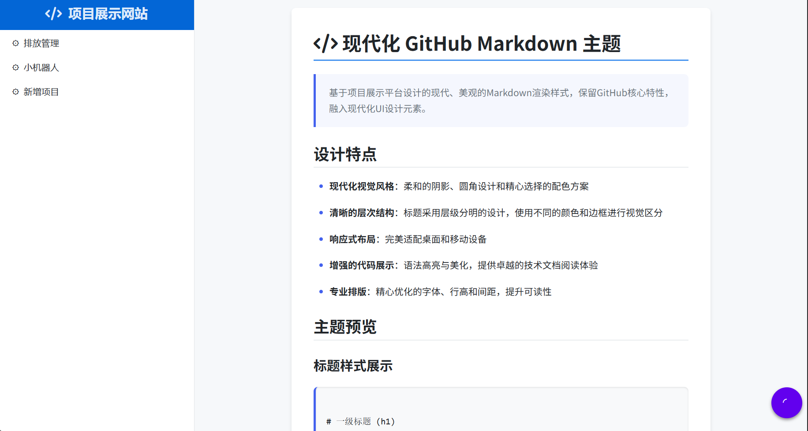
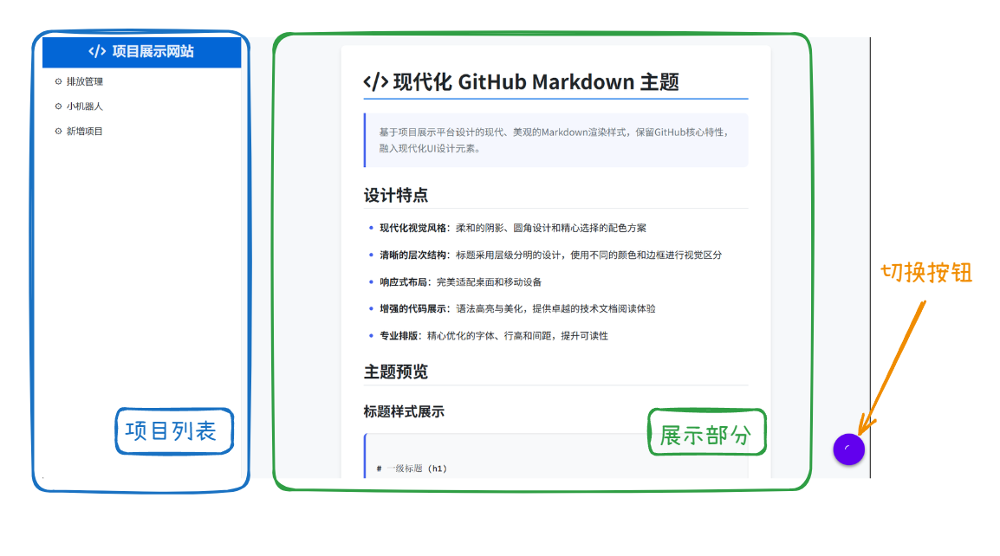
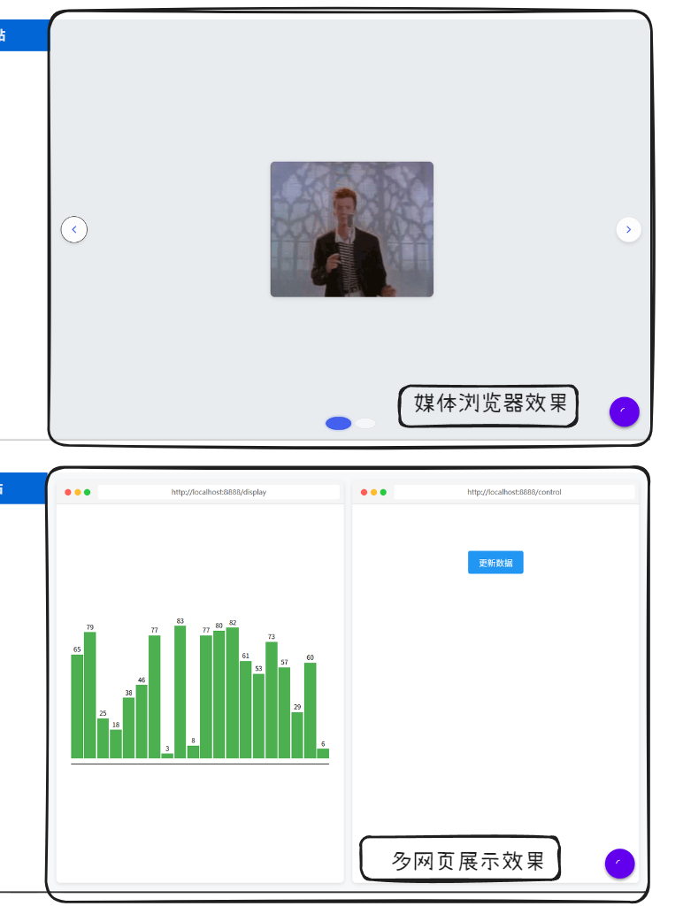

# 项目展示系统

一个简单的项目展示页面，目前具有如下功能：
1. 基于 Yaml 文件管理项目信息
2. 为每一个项目编写 Markdown 文件作为介绍展示
3. 为项目配置为使用网站展示或是使用媒体展示

一切从简



预计完成功能：
- [ ] 一键启动项目
- [ ] 使用数据库管理系统信息
- [ ] 项目的标签查询功能
- [ ] 优化 UI


## 使用方法

### 0. 下载
直接进行一个 `git clone`

### 1. 启动项目

目前需要手动启动前后端：
```shell
# 进入前端文件夹
cd frontend
npm run dev


cd - # 回到主目录
# 进入后端文件夹
cd backend
go run main.go server --mock
```

### 2. 查看信息

在左侧导航栏可以选择要查看的项目



页面右侧初始展示介绍信息。
通过点击右下角的原型按钮可以切换展示。




### 3. 修改项目信息

在 `--mock` 开关作用下，项目信息完全由 [Yaml文件](backend\mock\mock_info.yaml) 控制，修改该文件就可以控制项目展示效果。

项目增删改均通过操作该文件完成
```Yaml
# 原本
- Name: 排放管理
  Type: URL
  Description:
    MDFilePath: a.md
  Tags:
    - tag1
    - tag2
  Params:
    URLs: 
      - http://localhost:8888/display
      - http://localhost:8888/control
- Name: 小机器人
  Type: Vedio
  Description:
    MDFilePath: b.md
  Tags:
    - tag2
    - tag4
  Params:
    Paths: 
      - never.gif
      - last.mp4
# 添加项目实现新增
- Name: 新增项目
  Type: URL
  Description:
    MDFilePath: mock_info.md
  Params:
    URLs: 
      - http://baidu.com
```

> 注意，URL版的连接需要以协议开头，如`http://`
> 否则可能出现展示该网站页面的情况
